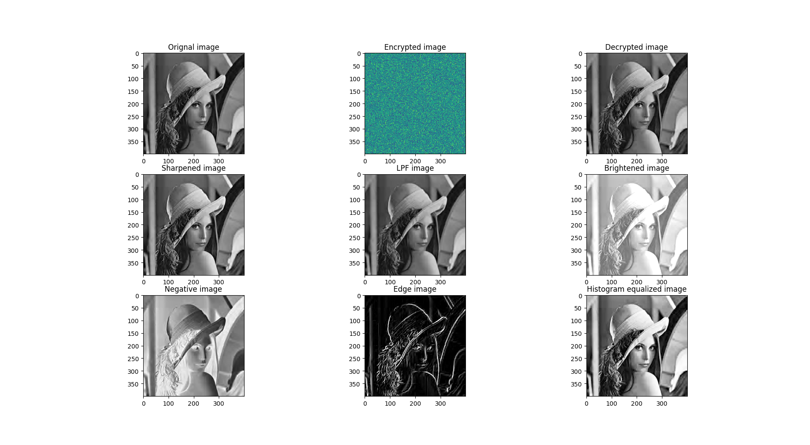
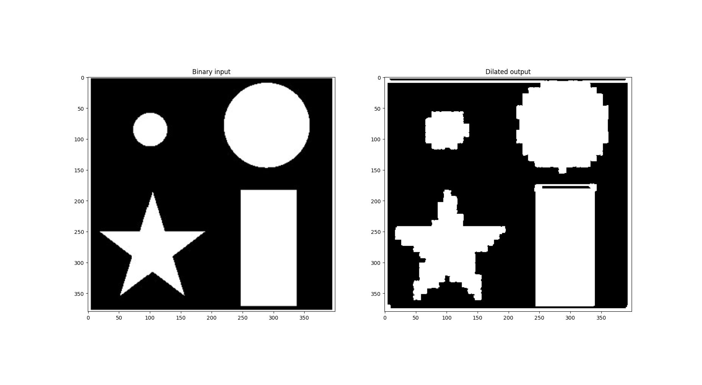

# Paillier-HME-filters-for-images
Course project for CS-416 (M) at IIT Bombay.   
This package performs Paillier Homomorphic encryption [[read more here](https://en.wikipedia.org/wiki/Paillier_cryptosystem)] on images. Complete python implementation of [this](https://ieeexplore.ieee.org/document/7860550) paper from scratch. This code contains ecryption and decryption functions to be applied on images. It also contains basic image filters which can be applied to ciphered images to get desired changes in decrypted images.
  
## Examples:
   

Here, all the filters were applied on ciphered images and then decrypted.

## Setup:
Install all packages from requirements.txt as `pip3 install -r requirements.txt`

## Run the code:
1. Running sample driver code: `python main.py`
2. Running experiments: 
	1. Select what function to run by changing the function name in __main__ module
	2. Run python file as `python experiments.py`

## Function documentation:
### 1. crypt_utils.py:

1. **generate_keypair(num_digit)** : Generates a tuple of (private, public) of _num_digit_ number of digits
2. **encrypt(public, plain)**: Encrypts the _plain_ data using the _public_ key and returns a tuple (encypted mantissa, plain text exponent)
3. **decrypt(private, public, cipher)**: Decrypts the tuple _cipher_ data using the _private_ and _public_ key and returns plaintext message
4. **paillier_add(public, c1, c2)**: Add _c1_ cipher with _c2_ cipher where _c1_ and _c2_ are ciphers of integers using _public_ key and return resulting cipher
5. **paillier_sub(public, c1, c2)**: Subtract _c1_ cipher from _c2_ cipher where _c1_ and _c2_ are ciphers of integers using _public_ key and return resulting cipher
6. **paillier_mul(public, c1, m1)**: Multiply _c1_ cipher with _m1_ constant where _c1_ is ciphers of integer and m1 is an integer using _public_ key and return resulting cipher
7. **new_paillier_add(public, c1, c2)**: Modified Paillier addition of _c1_ cipher with _c2_ cipher where _c1_ and _c2_ are ciphers of floating point real numbers using _public_ key and return resulting cipher
8. **new_paillier_sub(public, c1, c2)**: Modified Paillier subtraction of _c1_ cipher from _c2_ cipher where _c1_ and _c2_ are ciphers of floating point real numbers using _public_ key and return resulting cipher
9. **new_paillier_mul(public, c1, m1)**: Modified Paillier muultiplication of _c1_ cipher with _m1_ constant where _c1_ is ciphers of floating point real number and m1 is an floating point real numbers using _public_ key and return resulting cipher

### 2. math_utils.py:

1. **invmod(a, p)**:  Returns _b_ where _b_  is calculated such that _a_ x _b_ = 1(mod _p_) given _a_ and _p_
2. **modpow(b, e, m)**:  Returns value _b_^_e_(mod _m_) given _b_, _e_ and _m_
3. **custom_frexp(num)**: Returns the tuple (mantissa, exponent) where _num_ = mantissa x 2 ^ exponent where mantissa is an integer and exponent is a non-positive integer
4. **gkern(kernlen=3, nsig=3):** Returns a numpy matrix of 2D gaussian kernal of dimension(_kernlen_ x _kernlen_) with sigma as _nsig_

### 3. image_utils.py:

1. **merge_m_e(tup)**: Merge tuple _tup_ of (encypted mantissa, plain text exponent) into one number and return it so that it can be used as an image pixel
2. **unmerge_m_e(pixel)**: Unmerge the number _pixel_ into tuple of (encypted mantissa, plain text exponent) return it so that it can be used for cryptic operations
3. **Im_encrypt(public, plain_im)**: Encrypts original image _plain_im_ using _public_ key and returns encrypted numpy array of same shape as image
4. **Im_decrypt(private, public, cipher_im)**: Decrypts ciphered image _cipher_im_ using _private_ and _public_ key and returns plaintext numpy array of same shape as image
5. **Brighten(public, cipher_im, factor)**: Adds brightness equal to _factor_ pixelwise to ciphered image _cipher_im_ using _public_ key and returns new ciphered numpy array
6. **Negation(public, cipher_im)**: Adds negation filter pixelwise to ciphered image _cipher_im_ using _public_ key and returns new ciphered numpy array
7. **LPF(public, cipher_im, filter_type='linear', kernal_size=3)**: Adds low pass filter of type [_'linear'_ or _'gaussian'_] and kernal size _kernal_size_ to ciphered image _cipher_im_ using _public_ key and returns new ciphered numpy array
8. **Sharpen(public, cipher_im, k)**: Adds sharpening equal to _k_ pixelwise to ciphered image _cipher_im_ using _public_ key and returns new ciphered numpy array
9. **Dilation(public, cipher_im, kernal_size=3)**: Adds dilation of kernal size _kernal_size_ to ciphered image _cipher_im_ using _public_ key and returns new ciphered numpy array. This filter should have a binary image as input to get better results.
10. **Edge(public, cipher_im)**: Shows the edges of the image from ciphered image _cipher_im_ using _public_ key and returns two new ciphered numpy arrays Gradient X and Gradient Y. User has to decrypt and take root of squared sum to obtain gradient in both directions.
11. **Hist_equal(public, H, img_size)**: Takes in pixel binned Histogram of original image _H_ and image size _img_size_  and returns pixel mapping function (a list) as output using the _public_ key

### 4. main.py:
Sample driver code  

### 5. experiments.py:
Sample code for experiments